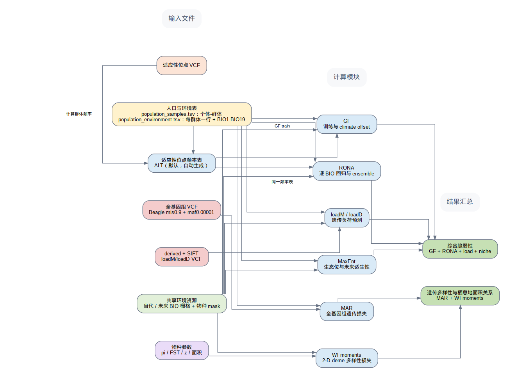
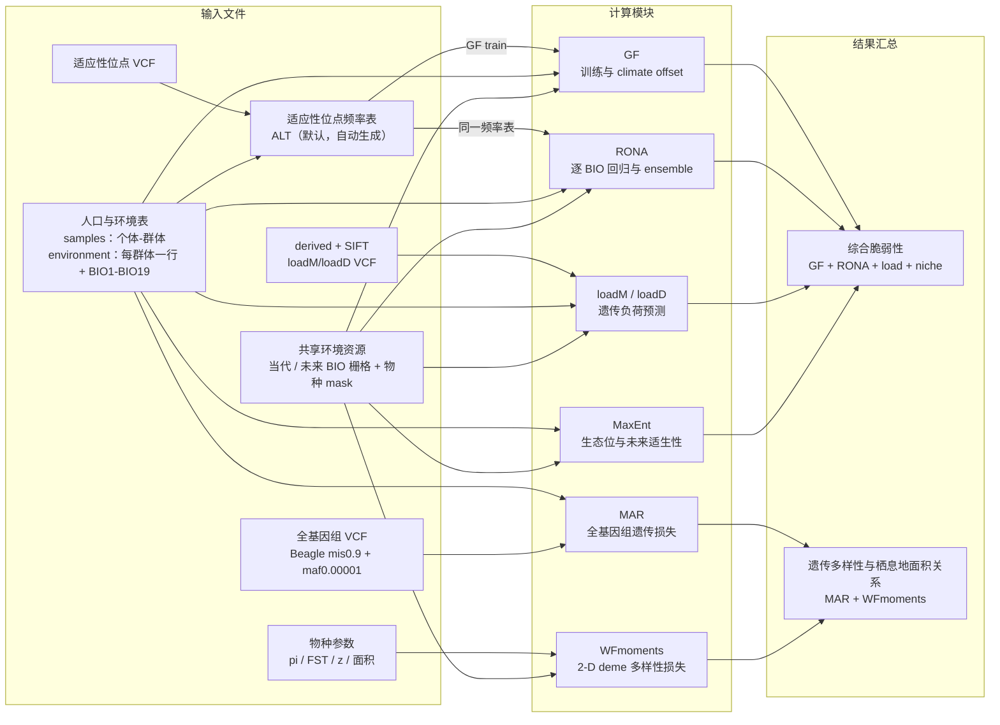

# BioMA 软件结构图

下面是面向读者的三列简化视图：第一列是用户输入文件和统一生成表，第二列是计算模块，
第三列上方是综合脆弱性，下方是遗传多样性与栖息地面积关系。图中不展示
项目缓存、校验文件或脚本级中间文件。可编辑的 Graphviz 源文件是
`architecture.dot`；PNG 和 SVG 版本也随软件发布。





## 输入表的约定

`population_samples.tsv` 是个体层主表，至少包含：

```text
sample_id    population_id
```

每个测序个体占一行。它用于把 VCF 样本归入群体，并为 MAR、loadM/loadD
等模块生成兼容的样本清单。

`population_environment.tsv` 是群体层环境表，推荐每个群体只有一行：

```text
ID    pop    lon    lat    bio1 ... bio19
```

其中 `ID` 与 `population_id` 对应，`pop` 是群体组别，`lon/lat` 是群体代表
坐标，`bio1`--`bio19` 是该群体的环境值。不要把每个个体都复制成一行，
因为 GF 和 RONA 的回归单位是群体；如果原始数据是个体层环境，应先按
群体汇总或去重，再写入这张表。

适应性位点 VCF 经过一次群体频率计算，生成适应性位点频率表，默认使用
ALT allele frequency。该表同时供 GF training 和 RONA 使用，用户不需要
另外维护一份 RONA 专用的 `alt.frq`。

## RONA 的 LD 处理边界

图中没有单独画出 RONA 的 LD-pruning 文件，因为它是计算实现层的中间输入，
不是读者需要理解的科学数据流。需要特别注意：LD-pruning 不能由
`population_environment.tsv` 的 BIO 列推断。LD 需要基因型位点、染色体/位置
以及窗口、步长、`r2` 等参数；而环境表只描述群体环境。

因此当前软件仍保留兼容旧流程的 `rona_unld_dir` 配置。若要在下一版真正
删除这个用户输入，应先确定一种可复现的策略：

1. 从适应性位点 VCF 自动运行 LD pruning，并记录窗口、步长和 `r2`；或
2. 由上游关联分析提供 `BIO -> candidate loci` 表，再由软件按 BIO 读取这些
   位点并完成 LD pruning。

在策略确定前直接把 `unld_dir` 改成从环境表生成，会改变 RONA 的位点集合，
并且在科学上是不成立的。当前图的简化不改变已有 RONA 数值流程。

## 三类基因组数据保持分开

- GF/RONA：适应性位点 VCF及其群体频率表；
- MAR：Beagle 过滤后的全基因组 VCF，即 `mis0.9 + maf0.00001`；
- loadM/loadD：derived 判断后并经过 SIFT 注释的 VCF。

三类 VCF 的处理历史和统计含义不同，不建议为追求文件数量少而物理合并。

项目运行时会在 `00_project/input_manifest.json` 保存这些输入的内容级 provenance：
普通文件采用分块 SHA-256，目录采用相对路径排序后的递归清单哈希，`.shp` 及其
同名 sidecar 会作为一个逻辑输入处理。项目签名依赖这些哈希，因此输入内容变化
会在生成兼容表之前被检测到。
